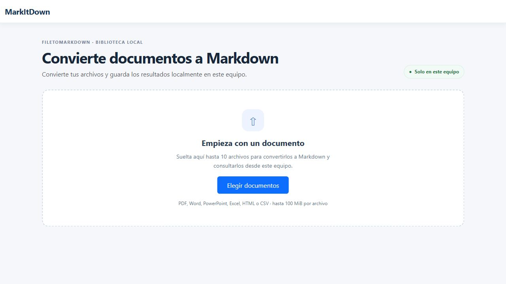
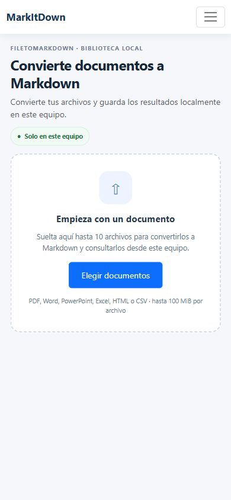

# FileToMarkdown

Biblioteca local para convertir documentos a Markdown, buscar su contenido y consultar fragmentos con referencias a su archivo y sección de origen.

**Escritorio**



**Móvil**



## Funciones

- Importa hasta 10 archivos por lote; cada archivo puede ocupar hasta 100 MiB. El estado de conversión se muestra por archivo y un error no detiene los demás.
- Convierte PDF, DOCX, PPTX, XLSX, HTML y CSV con [Microsoft MarkItDown](https://github.com/microsoft/markitdown).
- Previsualiza, copia y descarga Markdown. El historial local permite reabrir o borrar conversiones.
- Indexa el Markdown en fragmentos de hasta 1.200 caracteres y busca nombres de archivo y contenido en SQLite.
- Consulta la biblioteca con respuestas extractivas: muestra el fragmento coincidente y cita el archivo y la sección. Si no encuentra evidencia, lo indica explícitamente.

La búsqueda y las consultas son locales y no necesitan claves ni conexión a un proveedor de IA. `IAnswerGenerator` permite añadir otro generador, pero esta versión solo registra el generador extractivo local y no envía documentos fuera del equipo.

## Requisitos

- [.NET SDK 10](https://dotnet.microsoft.com/download/dotnet/10.0)
- Python 3.12 o posterior y `pip` para Microsoft MarkItDown

## Instalación y ejecución

Desde la raíz del repositorio, crea un entorno e instala MarkItDown con sus dependencias opcionales:

```powershell
py -3.12 -m venv .venv
.\.venv\Scripts\python.exe -m pip install --upgrade pip
.\.venv\Scripts\python.exe -m pip install 'markitdown[pdf,docx,pptx,xlsx]'
```

Antes de iniciar la aplicación, configura el ejecutable de Python del entorno virtual. Así MarkItDown y sus dependencias quedan aislados del Python global:

```powershell
$env:MarkItDown__PythonPath = (Resolve-Path .venv\Scripts\python.exe).Path
dotnet run --project src/Web/MarkItDownWeb.Web.csproj --launch-profile http
```

Abre [http://localhost:5241](http://localhost:5241). Si prefieres usar una instalación global, establece `MarkItDown__PythonPath` con la ruta completa a ese ejecutable antes de iniciar la app.

## Uso

1. Pulsa **Importar documentos** y selecciona archivos permitidos. Se procesan de uno en uno; el estado o error aparece junto al nombre del archivo.
2. Busca por nombre o contenido desde la barra superior. La lista central muestra tipo, fecha y estado.
3. Selecciona un documento para abrir su Markdown en el panel de detalle. Desde ahí puedes copiar, descargar o borrar.
4. Usa **Pregunta a la biblioteca** para consultar fragmentos relacionados con sus citas. Sin coincidencias, la app informa que no encontró respaldo. En móvil, el detalle queda debajo de la lista.

## Almacenamiento y privacidad

SQLite conserva los metadatos y los fragmentos indexados. Los resultados Markdown se guardan localmente en `Storage/Markdown`; el documento original solo existe en un archivo temporal durante la conversión y se elimina al terminar. Al borrar una conversión también se borran sus fragmentos por clave foránea y su archivo Markdown. Al iniciar, la app indexa conversiones existentes que todavía no tengan fragmentos.

Las rutas se configuran en `src/Web/appsettings.json` (`ConnectionStrings:DefaultConnection`, `Storage:UploadsFolder` y `Storage:MarkdownFolder`). La aplicación no incluye autenticación; mantenla accesible solo desde tu equipo y no la expongas a una red pública.

## Arquitectura

```text
src/
  Domain/          Conversiones y fragmentos indexados
  Application/     Conversión, división Markdown, búsqueda y respuesta extractiva
  Infrastructure/  MarkItDown, almacenamiento local y persistencia SQLite
  Web/             Interfaz y endpoints ASP.NET Core MVC
tests/             Pruebas de conversión, búsqueda, citas, validación y borrado
```

La tabla `DocumentChunks` se crea al iniciar. Esto conserva las bases SQLite existentes sin modificar su tabla de historial; los fragmentos se eliminan en cascada al borrar una conversión.

## Formatos y límites verificados

La aplicación acepta `.pdf`, `.docx`, `.pptx`, `.xlsx`, `.html` y `.csv`, limita cada archivo a 100 MiB y rechaza extensiones no permitidas. También comprueba las firmas PDF/ZIP de PDF y documentos Office; HTML y CSV no tienen una comprobación de firma. MarkItDown y sus dependencias instaladas determinan qué contenido puede extraerse de cada archivo.

Las pruebas del repositorio verifican validación, indexación, búsqueda, citas, abstención y eliminación con un conversor simulado. También se comprobó manualmente la conversión e indexación de archivos PDF, DOCX, PPTX, XLSX, HTML y CSV. La extracción depende de MarkItDown; los PDF no reciben número de página de forma uniforme. La app cita los marcadores de página que existan en el Markdown y, en su ausencia, cita encabezados/secciones o `Contenido`. La búsqueda es léxica; no interpreta sinónimos ni genera resúmenes. No incluye OCR ni cuentas multiusuario.

## Verificación

```powershell
dotnet build MarkItDownWeb.slnx --configuration Release --warnaserror
dotnet test MarkItDownWeb.slnx --configuration Release
```

GitHub Actions ejecuta build con warnings como errores y las pruebas al abrir o actualizar un pull request y al hacer push a `master`.
