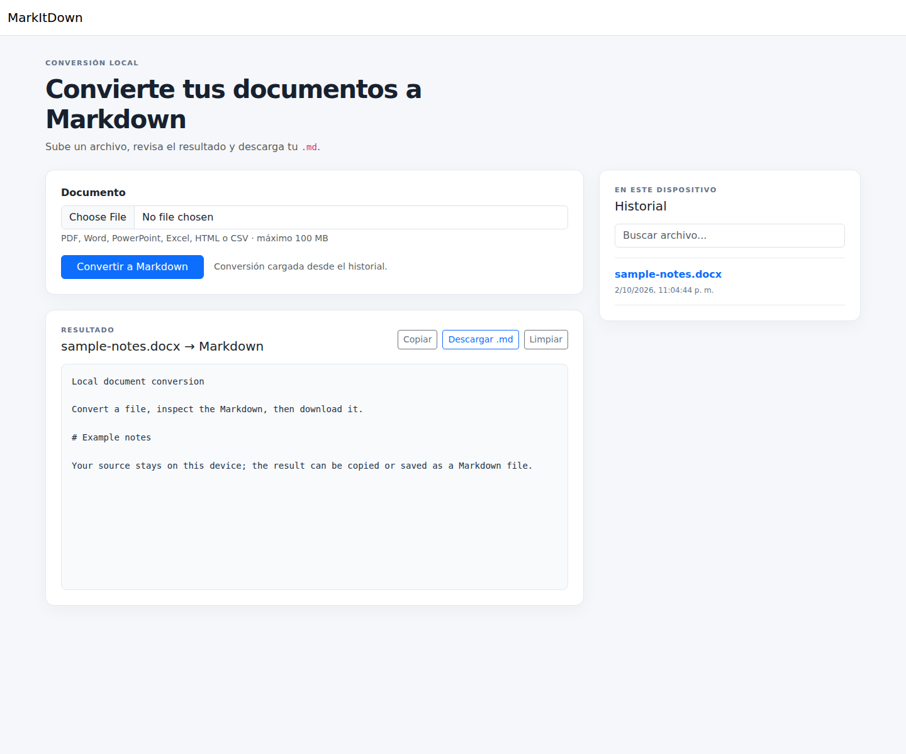

# FileToMarkdown

Aplicación web local para convertir documentos a Markdown. Selecciona un archivo, revisa el resultado en el navegador y descarga un `.md` con el nombre del documento original.

## Captura



## Funciones

- Interfaz web responsive con vista previa, copia y descarga del Markdown.
- Historial local de conversiones con búsqueda y reapertura de resultados.
- Conversión de PDF, DOCX, PPTX, XLSX, HTML y CSV mediante [Microsoft MarkItDown](https://github.com/microsoft/markitdown).
- Base de datos SQLite y archivos de resultado guardados en el equipo.
- Validación de extensión, tamaño máximo de 100 MiB y firma de archivos PDF/Office.

La aplicación se ejecuta en tu equipo. Los archivos se envían al proceso web local y a MarkItDown; esta configuración no proporciona autenticación, así que mantenla accesible solo desde tu propio equipo y no la expongas a una red pública.

## Requisitos

- [.NET SDK 10](https://dotnet.microsoft.com/download/dotnet/10.0)
- Python y `pip`

## Ejecutar en local

Desde la raíz del repositorio:

```bash
python -m venv .venv
```

Activa el entorno virtual y luego instala MarkItDown:

```bash
# Windows PowerShell
.venv\Scripts\Activate.ps1
python -m pip install --upgrade pip
python -m pip install 'markitdown[all]'
```

```bash
# Linux / macOS
source .venv/bin/activate
python -m pip install --upgrade pip
python -m pip install 'markitdown[all]'
```

Inicia la interfaz:

```bash
dotnet run --project src/Web/MarkItDownWeb.Web.csproj --launch-profile http
```

Abre [http://localhost:5241](http://localhost:5241). La ruta del ejecutable de Python se puede configurar con `MarkItDown__PythonPath`; por defecto se usa `python` del entorno activo. Por ejemplo, en PowerShell:

```powershell
$env:MarkItDown__PythonPath = (Get-Command python).Source
dotnet run --project src/Web/MarkItDownWeb.Web.csproj --launch-profile http
```

## Comprobar cambios

```bash
dotnet test MarkItDownWeb.slnx --configuration Release
```

GitHub Actions ejecuta la misma comprobación al abrir o actualizar un pull request y al hacer push a `master`.

## Uso

1. Elige un PDF, DOCX, PPTX, XLSX, HTML o CSV de hasta 100 MiB.
2. Pulsa **Convertir a Markdown** y revisa el contenido generado.
3. Cópialo o descárgalo como `<nombre-del-documento>.md`.
4. Abre una conversión anterior desde el historial. Los datos permanecen en el equipo.

## Datos locales

La base de datos SQLite se crea automáticamente. Los archivos temporales se eliminan al terminar la conversión; el historial conserva los resultados Markdown y los metadatos. Las carpetas se pueden cambiar desde `src/Web/appsettings.json` (`Storage:UploadsFolder`, `Storage:MarkdownFolder` y `ConnectionStrings:DefaultConnection`). No se conserva el documento original después de convertirlo.

## Estructura

```text
src/
  Domain/          Entidades y tipos de conversión
  Application/     Flujo de conversión e interfaces
  Infrastructure/  MarkItDown, almacenamiento y SQLite
  Web/             Interfaz ASP.NET Core MVC
```

## Limitaciones conocidas

- La calidad del Markdown depende del formato y del contenido del documento original.
- MarkItDown puede necesitar dependencias adicionales para ciertos formatos; consulta su documentación si la instalación completa no está disponible en tu plataforma.
- Esta versión está pensada para uso local individual; no incluye cuentas, aislamiento entre usuarios ni almacenamiento en la nube.
